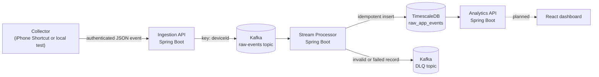

# Personal Usage Streaming Analytics

A local-first, real-time data engineering project for collecting personal app-usage events and processing them as a durable event stream.

The first working slice records an app `OPEN` or `CLOSE` event, authenticates it at an HTTP API, publishes it to Kafka, and persists it in TimescaleDB.

## Architecture



## Current capabilities

| Component | Status | Responsibility |
| --- | --- | --- |
| Ingestion API | Working | Validates authenticated requests and publishes events to Kafka. |
| Kafka | Working | Buffers raw events and retains failed records in a dead-letter topic. |
| Stream processor | Working | Consumes events and writes idempotently to TimescaleDB. |
| TimescaleDB | Working | Stores timestamped raw events in a hypertable. |
| iPhone Shortcut collector | Working on the home LAN | Sends Instagram `OPEN` and `CLOSE` events to the ingestion API. |
| Analytics API | Working | Serves latest-session, usage-rollup, and anomaly-summary metrics from TimescaleDB. |
| React dashboard | Planned | Will display session, rollup, and live-usage views. |

## Event contract

The versioned contract is defined in [contracts/app-usage-event.v1.schema.json](contracts/app-usage-event.v1.schema.json).

```json
{
  "eventId": "7a10bddd-8e2c-4c89-bb41-8e03995a5c0d",
  "occurredAt": "2026-08-10T12:00:00Z",
  "eventType": "OPEN",
  "app": "instagram",
  "source": "ios-shortcuts",
  "deviceId": "iphone-personal"
}
```

Events are keyed by `deviceId` in Kafka so a device's events retain their order within a partition. The database uses `(event_id, occurred_at)` as its primary key because TimescaleDB unique constraints must include the time-partitioning column. Reprocessing the same Kafka record is therefore safe.

## Run locally

Requirements:

- Docker Desktop
- Java 21
- Maven 3.9+
- A local `.env` file populated from Bitwarden; never commit it

The complete tested setup—including Docker health checks, starting all three Spring Boot services, submitting a session, and querying analytics—is in [docs/local-development.md](docs/local-development.md).

On this Windows development machine, Docker TimescaleDB is exposed on port `5433`. Port `5432` is reserved by a separate native PostgreSQL installation.

## Repository layout

```text
contracts/                  Versioned event contract
infrastructure/             Docker Compose, Kafka, and TimescaleDB setup
services/ingestion-api/     Authenticated HTTP-to-Kafka service
services/stream-processor/  Kafka-to-TimescaleDB persistence service
services/analytics-api/     Read-only TimescaleDB analytics service
docs/                       Local-development and operational guidance
big_brain.md                Architecture decisions and roadmap
```

## Data safety and secrets

- Secrets are stored in Bitwarden and copied only into the ignored `.env` file.
- The ingestion API compares the collector token before accepting an event.
- Kafka and TimescaleDB use named Docker volumes, so ordinary `docker compose down` preserves local data.
- Records that cannot be processed are routed to `app-usage-events.dlq.v1` rather than silently discarded.

## Verification

The current pipeline has been verified locally with:

- Maven tests for the ingestion API, stream processor, and analytics API
- Docker Compose configuration and health checks
- An authenticated API request persisted through Kafka into TimescaleDB
- Unauthenticated (`401`) and invalid-payload (`400`) API checks
- A forced processing failure retained in the Kafka DLQ
- Real Instagram `OPEN` and `CLOSE` events sent from an iPhone Shortcut over the home LAN and persisted in TimescaleDB
- `OPEN`/`CLOSE` event pairs converted into completed sessions and minute, hourly, and daily usage rollups
- Analytics API queries for the latest session and usage rollups
- GitHub Actions tests for the ingestion API, stream processor, and analytics API

The current end-to-end verification procedure is documented in [docs/local-development.md](docs/local-development.md).

## Roadmap

1. Build a React dashboard for session and rollup metrics.
2. Add live dashboard updates and measure request-to-dashboard latency.
3. Expand automated integration coverage for the full local pipeline.
4. Make the iPhone collector available outside the home LAN through a secure HTTPS tunnel.
