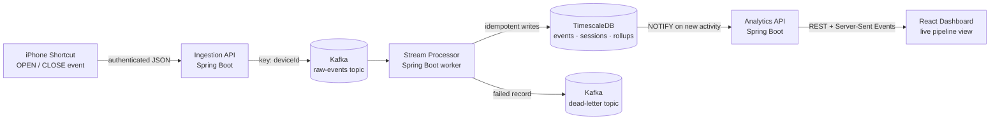

# Digital Habits — Personal Usage Streaming Analytics

A real-time data platform that tracks my own phone usage. An iPhone Shortcut
fires on every app open/close; the event streams through Kafka, gets
sessionized and rolled up in TimescaleDB, and shows up live on a public
dashboard — including an animation of the actual event moving through the
pipeline as it happens.

It started as a single-app (Instagram) proof of concept. It now tracks 40+
real apps, runs a staging environment that mirrors production, and deploys
itself through GitOps.

**Live:** https://behavior-dashboard.taildcd567.ts.net/

## How data flows



Everything above is one identical code path for two environments — see
[Staging and production](#staging-and-production) below.

## What each piece does

| Component | Responsibility |
| --- | --- |
| **Ingestion API** | Authenticates the request (`X-Collector-Token`), validates the event contract, publishes to Kafka. Nothing else — it returns as soon as Kafka acknowledges. |
| **Kafka** | Durable, ordered (per device) buffer between ingestion and processing. A dead-letter topic catches anything the processor can't handle. |
| **Stream processor** | The only write path to TimescaleDB. A background worker (no HTTP API) that pairs opens/closes into sessions, builds minute/hour/day rollups, closes abandoned sessions, and looks up each app's icon. |
| **TimescaleDB** | Raw events, sessions, rollups, and app icons — the full history behind every chart. |
| **Analytics API** | Read-only. Serves the dashboard's metrics over REST, and streams live activity over Server-Sent Events (fed by a Postgres `LISTEN/NOTIFY` the stream processor triggers). |
| **Dashboard** | React + TypeScript, served by nginx. Usage charts, session history, and an animated diagram of the pipeline itself. |

## Staging and production

Every merge to `main` deploys automatically to **staging**. Shipping to
**production** is a separate, manually-triggered step — and it's *enforced*,
not just documented: the promotion workflow refuses to run unless staging is
already running the exact commit being promoted.

| | Staging | Production |
| --- | --- | --- |
| Deploys | Automatically, on every merge | Manually (`workflow_dispatch`), only if staging already matches `main` |
| Database | Its own TimescaleDB | The real one |
| Kafka | Its own topics + consumer group — also reads production's real event stream read-only, so write-path changes get tested against real traffic without touching production's data | Production topics and consumer group |
| Reachable at | Tailnet-only | Public (Tailscale Funnel), rate-limited |
| Live activity feed | Shows real app names | Also shows real app names (deliberately, for demos) |

CI enforces the isolation between them: a check fails the build if staging's
rendered config could ever write to a production topic, share its consumer
group, or collide with a production port.

## Event contract

The versioned contract is [contracts/app-usage-event.v1.schema.json](contracts/app-usage-event.v1.schema.json).

```json
{
  "eventId": "7a10bddd-8e2c-4c89-bb41-8e03995a5c0d",
  "occurredAt": "2026-08-10T12:00:00Z",
  "eventType": "OPEN",
  "app": "Google Maps",
  "source": "iPhone Shortcut",
  "deviceId": "iPhone 16 Pro"
}
```

- `app` is required for `OPEN` events. A `CLOSE` omits it — the processor
  closes every active session for that device and keeps each session's app
  in its history and rollups.
- Names are stored exactly as sent (only surrounding whitespace is trimmed),
  not slugified — `"Google Maps"` stays `"Google Maps"`.
- Events are keyed by `deviceId` in Kafka, so one device's events stay in
  order. The database key is `(event_id, occurred_at)`, so replaying the
  same Kafka record is always safe.

## Run it yourself

**Locally (Docker Compose):** the full stack — Kafka, TimescaleDB, all three
Spring Boot services, and the dashboard — with step-by-step verification, is
in [docs/local-development.md](docs/local-development.md).

**On the real cluster:** the project runs on a self-hosted k3s cluster,
deployed with GitOps (Argo CD). One-time bootstrap, staging secrets, and the
Tailscale setup for both dashboard URLs are in
[kubernetes/README.md](kubernetes/README.md). The full promotion model —
how staging and production actually get deployed, and how to roll back — is
in [docs/ci-cd.md](docs/ci-cd.md).

## Repository layout

```text
contracts/          Versioned event contract
infrastructure/      Docker Compose stack + Postgres/Timescale init scripts
kubernetes/          Kubernetes manifests shared by both environments
gitops/              Per-environment overlays Argo CD deploys from
argocd/              Argo CD Application definitions
services/
  ingestion-api/     Authenticated HTTP -> Kafka
  stream-processor/  Kafka -> TimescaleDB (sessions, rollups, icons)
  analytics-api/     Read-only queries + live SSE stream
  dashboard/         React frontend, served by nginx
docs/                Local development + CI/CD and promotion model
.github/             CI: tests, image builds, staging/production promotion
big_brain.md         Where the project actually stands and why
```

## Data safety and secrets

- Secrets live in Bitwarden and are copied only into ignored files
  (`.env` locally, Kubernetes Secrets on the cluster) — never committed.
- The ingestion API checks a collector token before accepting anything.
- Records the processor can't handle go to a dead-letter topic instead of
  being silently dropped.
- Staging reads production's real events (to test with real traffic) but
  can never write back to production's topics, database, or consumer group
  — enforced in CI, not just by convention.

## What's next

- The public dashboard's live feed currently shows real app names by
  design (for demos); an anonymous mode existed before and can be brought
  back if that trade-off changes.
- No automated runtime smoke tests yet — a green CI run confirms tests and
  a successful deploy, not end-to-end health. Argo CD's Synced/Healthy
  status and the deployed image tag are the current check.
- Historical rows from before exact-name matching (old lowercase slugs)
  haven't been backfilled to their real names.
