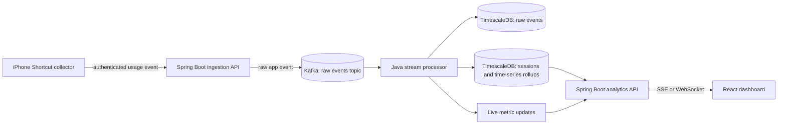
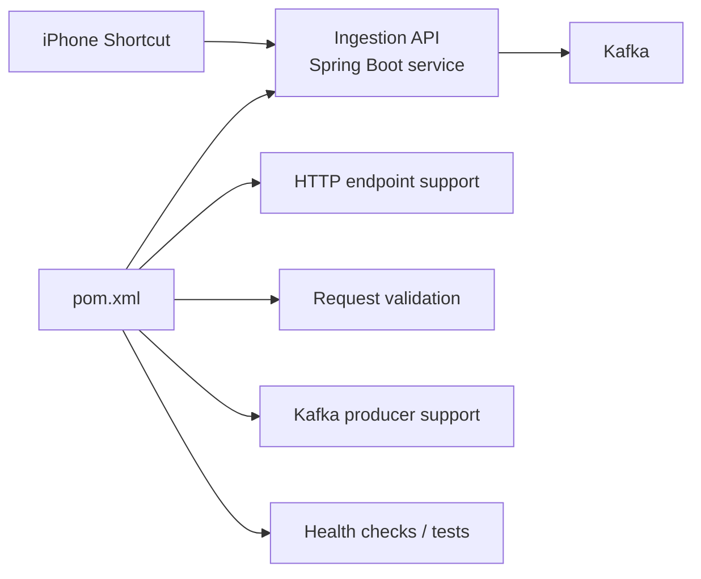

# Personal Usage Streaming Analytics — Project Brain

## Current desired architecture

## 1. Project Intent

This project is a personal data engineering and full-stack streaming analytics project.

The purpose is to track selected real-life user behavior, starting with Instagram usage from an iPhone, and process that behavior through a scalable streaming architecture that supports live analytics, time-series analytics, and future machine learning.

The project should prioritize data engineering, integration, scalability, observability, and DevOps workflow over frontend/backend polish.

The frontend and backend can remain simple at the beginning. The main learning value should come from the movement of data across collectors, ingestion, Kafka, stream processing, database storage, analytics APIs, and live dashboard updates.

---

## 2. Core Project Scope

Initial real-life data source:

- Instagram usage only
- iPhone-based event collection
- Event types focused on app open and app close
- Personal usage analytics, not commercial user tracking

Initial goal:

- Capture Instagram usage events
- Send events into a backend ingestion API
- Publish events into Kafka
- Process events into sessions and time buckets
- Store raw and derived data in PostgreSQL or TimescaleDB
- Serve live analytics to a frontend dashboard
- Keep request-to-dashboard processing close to 1 second after the network request is sent

This project is not intended to be a polished consumer app at first. It is intended to demonstrate a real-time data platform.

---

## 3. High-Level Architecture

Current target architecture:

- iPhone Shortcut collector
- Spring Boot ingestion backend
- Kafka event streaming layer
- Java stream processor
- PostgreSQL or TimescaleDB storage layer
- Spring Boot analytics API
- React dashboard
- Git and GitHub for version control and DevOps workflow

Conceptual flow:

iPhone Shortcut collector  
→ Ingestion API  
→ Kafka raw event topic  
→ Stream processor  
→ Raw event table  
→ Session table  
→ Minute, hourly, and daily time-series tables  
→ Feature tables  
→ Analytics API  
→ Frontend dashboard

Future flow:

iPhone Shortcut collector  
+ Windows collector  
+ macOS collector  
+ native iOS collector  
→ Same ingestion API  
→ Same Kafka topics  
→ Same processor and analytics platform

The long-term design principle is that the collector can change without forcing a rewrite of the platform.

---

## 4. Platform Independence

The core platform must not depend on Apple OS.

The Apple-specific part should be isolated to the collector layer.

Platform-independent components:

- Backend
- Kafka
- Stream processor
- Database
- Analytics API
- Dashboard
- DevOps pipeline
- Data model
- ML feature tables

Platform-specific components:

- iPhone Shortcut collector
- Future native iOS collector
- Future macOS collector
- Future Windows collector

The ingestion API should accept events from any valid collector as long as the event contract is respected.

This allows the project to start on Windows and later migrate or expand to macOS without changing the core data platform.

---

## 5. Windows-First Development Plan

The project should begin on Windows OS.

Windows responsibilities:

- Run Docker Desktop or WSL2-based containers
- Run Kafka locally
- Run PostgreSQL or TimescaleDB locally
- Run Spring Boot backend locally or inside Docker
- Run Java stream processor locally or inside Docker
- Run React frontend locally
- Use PowerShell 7 as the main terminal
- Use Git for local version control
- Push to GitHub for remote repository and DevOps workflow

The iPhone will act only as a data producer. The Windows machine owns the data platform.

Important local networking constraint:

The iPhone cannot call Windows localhost directly. The ingestion API must be reachable through the Windows LAN IP address or through a secure tunnel.

---

## 6. Future macOS and Xcode Development Plan

A future MacBook migration should be feasible and should not require re-architecting the data platform.

The MacBook will mainly unlock native Apple development options, especially Xcode-based development.

Possible future Apple-side improvements:

- Replace iPhone Shortcuts with a native iOS companion app
- Build a macOS active-application collector
- Experiment with Apple Screen Time-related APIs
- Use Xcode to build, test, and deploy Apple-platform collectors

The MacBook does not automatically grant unrestricted access to iPhone app usage data. Apple privacy restrictions, entitlements, sandboxing, and API limitations may still apply.

Future macOS/Xcode strategy:

- Keep iOS development as an optional collector upgrade
- Do not make native iOS tracking the foundation of the platform
- Maintain the same ingestion API and Kafka event contracts
- Treat native iOS and macOS apps as replaceable event producers

Migration principle:

Windows-first platform now.  
MacBook and Xcode later for better Apple collector development.  
Core streaming architecture remains unchanged.

---

## 7. Low-Latency Analytics Requirement

The project should support near-real-time analytics.

The target is:

Network request sent from collector  
→ Backend receives and processes event  
→ Kafka receives event  
→ Processor consumes event  
→ Database is updated  
→ Live metric is emitted  
→ Frontend reflects updated analytics  

Target processing time: approximately 1 second after the network request is sent.

The 1-second target starts after the network request is sent by the collector. It does not include the delay between opening Instagram and iOS deciding when to trigger the Shortcut automation.

The iOS automation trigger is best-effort. The backend-to-frontend analytics pipeline should be engineered for low latency.

Preferred live update design:

- Backend receives collector event
- Backend publishes event to Kafka
- Processor consumes and updates state
- Processor writes raw and derived records
- Processor emits live metric update
- Backend pushes update to frontend through SSE or WebSocket
- Frontend updates dashboard without waiting for slow polling

Polling can exist as a fallback, but not as the main design for the 1-second objective.

---

## 8. Data Model Direction

The data model should support raw event storage, sessionization, time-series analytics, and machine learning features.

Core data layers:

- Raw events
- App sessions
- Minute-level usage
- Hourly usage
- Daily usage
- ML-ready feature tables
- Future model prediction tables

Raw events preserve the original source-of-truth stream.

Sessions convert app open and close events into usage periods.

Time buckets convert irregular events and sessions into regular analytical time-series rows.

Feature tables support forecasting, anomaly detection, classification, and habit analysis.

Model predictions should be stored separately from observed facts.

---

## 9. Time-Series Analytics Plan

The project should be designed for time-series analytics from the beginning.

Initial time-series questions:

- How much Instagram usage occurred today?
- Which hour has the highest usage?
- How many times was Instagram opened?
- What is the average session length?
- Is night usage increasing?
- Is usage higher on weekends?
- Is today abnormal compared with the recent baseline?

Future time-series analytics:

- Rolling averages
- Hourly usage profile
- Daily usage trend
- Weekday versus weekend behavior
- Late-night usage patterns
- Usage spikes
- Anomaly detection
- Forecasting future usage

Time-series granularity should be layered:

- Minute-level for live analytics
- Hourly-level for behavioral patterns
- Daily-level for summaries
- Feature-level for ML

---

## 10. Machine Learning Readiness

The project should not start with machine learning infrastructure, but it should prepare for it.

Future ML use cases:

- Forecast next-day Instagram usage
- Predict high-usage periods
- Detect abnormal scrolling sessions
- Classify days into usage patterns
- Identify late-night behavior changes
- Compare actual usage against expected usage

Potential model categories:

- Simple moving average baseline
- Exponential smoothing
- Classical time-series forecasting
- Regression models
- Anomaly detection models
- Later deep learning only if justified by enough data

ML should train from derived time-series features, not directly from raw open and close events.

The project should first collect enough clean historical data before adding model training.

---

## 11. Database Direction

The initial database is TimescaleDB, using PostgreSQL-compatible schemas.

TimescaleDB is the row-oriented operational database for the early project. It fits the live ingestion and time-series analytics requirements while preserving PostgreSQL compatibility.

Initial storage responsibilities:

- Store raw events, sessions, and minute, hourly, and daily rollups
- Serve low-latency dashboard and analytics queries
- Support time-based retention and partitioning as the dataset grows
- Keep the application database-access layer clean enough to avoid tight coupling to one database extension

Do not introduce a columnar warehouse, data lake, or distributed OLAP system in the initial build. The personal dataset and near-real-time workload do not require one.

Future storage expansion:

- TimescaleDB remains the operational serving and analytics database
- Object storage can hold raw historical exports
- A columnar Iceberg or warehouse layer is an optional later addition for large-scale historical analytics or machine learning workloads

---

## 12. Kafka Direction

Kafka should be the backbone of the event-driven architecture.

Kafka responsibilities:

- Buffer incoming collector events
- Decouple ingestion from processing
- Preserve event ordering where needed
- Support replay
- Support future additional collectors
- Support future additional processors
- Support live metric fan-out

Initial topics:

- Raw app usage events
- Dead-letter events
- Live metric updates

Future topics:

- Validated app events
- Session events
- Usage aggregate events
- Feature update events
- Model prediction events

Partitioning principle:

Events should be partitioned by device or user-device identity so open and close events for the same device remain ordered.

---

## 13. Stream Processing Direction

The processor should own transformation logic.

Processor responsibilities:

- Consume raw usage events
- Validate event structure
- Deduplicate events
- Write raw events
- Pair open and close events into sessions
- Handle incomplete sessions
- Generate minute, hourly, and daily rollups
- Produce live metric updates
- Write latency tracking information
- Send bad records to dead-letter handling

The backend should not become the owner of sessionization and analytics transformation.

The backend should ingest, authenticate, publish, and serve.

The processor should transform.

The database should store.

The frontend should present.

---

## 14. Frontend Direction

The frontend should remain simple.

Initial dashboard sections:

- Current Instagram status
- Usage today
- Number of opens today
- Latest session duration
- Usage by hour
- Recent events
- Processing latency indicator

The frontend should support live updates through SSE or WebSocket.

Polling can exist as fallback but should not be the primary path for the low-latency goal.

Frontend quality is secondary. The goal is to show that the data platform works end-to-end.

---

## 15. Backend Direction

The backend has two roles:

- Ingestion API
- Analytics serving API

### Ingestion API Build Responsibilities

The ingestion API is a Spring Boot service. Its `pom.xml` declares the capabilities needed to receive, validate, and publish collector events without placing stream-processing logic in the request path.

Ingestion responsibilities:

- Accept collector events
- Authenticate events with a simple token initially
- Validate basic payload structure
- Publish accepted events to Kafka
- Return quickly

Analytics responsibilities:

- Serve current summaries
- Serve historical usage views
- Serve session views
- Serve time-series views
- Push live metric updates through SSE or WebSocket

The backend should not directly perform heavy analytics. It should serve already-derived data wherever possible.

---

## 16. DevOps Direction with Git and GitHub

Git and GitHub should be part of the project from the start.

Purpose:

- Version control
- Issue tracking
- Branch workflow
- Pull request practice
- CI pipeline practice
- Environment variable management
- Deployment planning
- Documentation discipline
- Release tracking

The GitHub workflow should simulate a professional data engineering workflow.

Repository should contain:

- Backend service
- Processor service
- Frontend service
- Database initialization and migration notes
- Infrastructure configuration
- Documentation
- Architecture notes
- Operational runbooks

GitHub should eventually manage:

- Issues
- Milestones
- Pull requests
- GitHub Actions checks
- Build validation
- Container image publishing
- Environment-specific deployment notes
- Release notes

---

## 17. Git Branching Strategy

Use a simple branch strategy first.

Main branch:

- Stable baseline
- Should always represent a runnable version

Feature branches:

- One branch per feature or milestone
- Used for backend, processor, frontend, database, and DevOps changes

Suggested feature branch categories:

- Infrastructure setup
- Ingestion API
- Kafka integration
- Database schema
- Stream processor
- Sessionization
- Live analytics
- Frontend dashboard
- GitHub Actions CI
- Observability
- ML feature tables
- Documentation

Avoid overcomplicated Git workflows at the start.

The point is to learn clean professional habits, not to create process overhead.

---

## 18. GitHub Actions CI/CD Direction

CI should be added incrementally.

Early CI checks:

- Backend build validation
- Processor build validation
- Frontend build validation
- Basic test execution
- Docker Compose configuration validation
- Documentation presence checks

Later CI checks:

- Container image builds
- Integration tests with Kafka and database
- Migration validation
- Static analysis
- Security scanning
- Environment-specific pipeline stages

Future CD possibilities:

- Deploy to local development environment
- Deploy to a small cloud VM
- Deploy to a container platform
- Publish container images to GitHub Container Registry
- Promote releases across development, staging, and production-like environments

CI/CD should support the project. It should not become the project too early.

---

## 19. Environment Strategy

Start with local development.

Initial environment:

- Local Windows machine
- Docker Compose
- Local Kafka
- Local PostgreSQL or TimescaleDB
- Local backend
- Local processor
- Local frontend

Future environments:

- Local development
- GitHub Actions test environment
- Cloud development environment
- Staging-like environment
- Optional production-like environment

Environment principles:

- Configuration should be externalized
- Secrets should not be committed
- Environment files should have examples but not real secrets
- Local setup should be reproducible
- Services should be container-friendly

### Bitwarden Secret Management

Bitwarden is the source of truth for the project's secrets during local development.

- Store the ingestion token, database credentials, Kafka credentials, tunnel credentials, and future deployment credentials in the personal Bitwarden vault
- Generate unique, strong values with Bitwarden rather than reusing passwords
- Copy secrets into the local `.env` file only when required by Docker Compose or a service; this file remains untracked by Git
- Never place real secrets in source code, documentation, screenshots, logs, Kafka events, or GitHub Actions configuration
- Rotate a secret in Bitwarden and every consuming local environment if it is exposed or no longer needed

---

## 20. Security and Privacy Direction

This project handles personal behavior data.

Security should be simple but intentional.

Initial security requirements:

- Ingestion endpoint protected with a token
- No secrets committed to Git
- Secrets stored and generated through Bitwarden; the local `.env` file remains untracked
- Local data treated as private
- Public repository should not contain personal usage records
- Clear separation between sample data and real personal data

Future security improvements:

- Rotate tokens
- Use HTTPS tunnel for external testing
- Add request signing
- Add collector identity
- Add rate limits
- Add audit logging
- Add retention rules
- Add local anonymization option

Privacy principle:

The project tracks personal Instagram usage for learning purposes. It should not evolve into covert tracking of other people.

---

## 21. Observability Direction

The system should expose enough information to debug the data pipeline.

Initial observability:

- Backend request logs
- Kafka topic visibility
- Processor consumption logs
- Database row counts
- Dashboard latency display
- Dead-letter event count

Future observability:

- End-to-end latency metrics
- Kafka consumer lag
- Event processing rate
- Error rate
- Duplicate event count
- Incomplete session count
- Processor restart behavior
- Database write latency
- Dashboard update latency

Observability is important because live analytics is only meaningful if latency and data quality can be measured.

---

## 22. Reliability Direction

The project should handle imperfect real-world events.

Expected issues:

- Duplicate events
- Missing close events
- Late events
- Network failures
- Backend downtime
- Kafka downtime
- Processor restart
- Database write failure
- iPhone Shortcut not firing immediately
- Manual collector configuration mistakes

Reliability features:

- Event IDs
- Idempotent writes
- Dead-letter handling
- Retry strategy
- Incomplete session handling
- Reprocessing from raw events
- Clear operational runbooks

The raw event layer should make replay possible.

---

## 23. Scalability Direction

The architecture should scale by component.

Collector scalability:

- Add more collectors without changing the platform
- Support iOS, Windows, macOS, and future sources

Ingestion scalability:

- Keep API lightweight
- Publish quickly to Kafka
- Avoid heavy processing in request path

Kafka scalability:

- Partition by device or user-device identity
- Add topics by processing stage
- Preserve replayability

Processor scalability:

- Move sessionization and rollups out of backend
- Scale consumers by partitions
- Separate processors by responsibility later

Database scalability:

- Separate raw events from serving tables
- Use time-series tables for analytics
- Add retention and partitioning later
- Consider TimescaleDB for better time-series management

Frontend scalability:

- Consume live updates
- Avoid expensive repeated queries
- Display precomputed analytics

ML scalability:

- Train from feature tables
- Store predictions separately
- Add model lifecycle only after enough data exists

---

## 24. Project Milestones

### Milestone 1 — Project Brain and Planning

Outcome:

- Architecture documented
- Scope defined
- Windows-first plan confirmed
- Future macOS/Xcode route acknowledged
- Git and GitHub DevOps plan included

### Milestone 2 — Repository and Infrastructure Baseline

Outcome:

- Git repository initialized
- GitHub repository created
- Docker Compose baseline planned
- Kafka and database architecture documented
- Local development workflow documented

### Milestone 3 — Ingestion Backbone

Outcome:

- Ingestion API accepts collector events
- Events are published to Kafka
- Basic authentication exists
- Event contract is stable

### Milestone 4 — Raw Event Persistence

Outcome:

- Processor consumes Kafka events
- Raw events are stored
- Duplicate handling exists
- Dead-letter path exists

### Milestone 5 — Sessionization

Outcome:

- Open and close events become usage sessions
- Incomplete sessions are handled
- Session records are queryable

### Milestone 6 — Time-Series Rollups

Outcome:

- Minute-level analytics exist
- Hourly analytics exist
- Daily analytics exist
- Dashboard can query time-series summaries

### Milestone 7 — 1-Second Live Analytics Path

Outcome:

- Request-to-dashboard target is measured
- Live metric updates are pushed
- Frontend updates without slow polling
- Latency metrics are visible

### Milestone 8 — Frontend Dashboard

Outcome:

- Basic dashboard displays usage
- Dashboard shows latest event and session state
- Dashboard shows time-series analytics
- Dashboard shows latency information

### Milestone 9 — GitHub Actions CI

Outcome:

- Basic build checks exist
- Pull requests are used
- Pipeline status becomes part of workflow
- Project resembles professional DevOps practice

### Milestone 10 — ML Feature Readiness

Outcome:

- Feature tables exist
- Historical data is usable
- Simple baselines can be trained
- Forecasting and anomaly detection become possible

### Milestone 11 — Future Collector Expansion

Outcome:

- Windows collector considered
- macOS collector considered
- Native iOS collector considered
- Xcode route evaluated if MacBook is available

---

## 25. Future Expansion Ideas

Possible future data sources:

- Instagram on iPhone
- Browser activity on Windows
- Active application on Windows
- Active application on macOS
- Native iOS app usage collector
- Manual mood or productivity annotations
- Calendar context
- Sleep or focus schedule
- Device notification patterns

Possible future analytics:

- Usage versus time of day
- Usage after work
- Usage before sleep
- Usage during study sessions
- Weekend versus weekday usage
- High-distraction days
- Usage anomaly alerts
- Forecasted usage
- Productivity correlation

Possible future engineering improvements:

- TimescaleDB continuous aggregates
- Kafka Streams or Flink
- GitHub Container Registry
- Cloud deployment
- Observability dashboard
- Alerting
- Data retention policy
- Local model training workflow
- Model prediction serving

---

## 26. Key Architectural Decisions

Decision 1:

The project starts with Instagram only.

Reason:

Small scope makes real end-to-end delivery more likely.

Decision 2:

The platform starts on Windows.

Reason:

Current development machine is Windows and should be sufficient for backend, Kafka, processor, database, frontend, and GitHub workflow.

Decision 3:

Apple Shortcuts is used only as an initial collector.

Reason:

It avoids immediate native iOS development and avoids requiring a MacBook at the start.

Decision 4:

The architecture remains collector-agnostic.

Reason:

Future collectors can be added without rewriting the platform.

Decision 5:

Kafka is included from the scalable version.

Reason:

Kafka decouples ingestion from processing and supports replay, scaling, and future ML pipelines.

Decision 6:

The backend should not own stream transformation.

Reason:

Stateful processing belongs in the processor layer.

Decision 7:

Time-series tables are part of the plan from the start.

Reason:

ML and behavioral analytics require regular time-bucketed features.

Decision 8:

The 1-second target applies after the collector sends the network request.

Reason:

The iOS trigger timing is not fully controlled by the project.

Decision 9:

GitHub is included for DevOps practice.

Reason:

The project should demonstrate professional software and data engineering workflow, not just local coding.

Decision 10:

TimescaleDB is the initial database, with no columnar analytics store in the first build.

Reason:

The project needs low-latency event ingestion, sessionization, and time-series queries on a personal dataset. TimescaleDB meets those needs while remaining PostgreSQL-compatible. A separate columnar warehouse can be added only if the project grows beyond local learning scope.

---

## 27. Open Questions

Technical questions:

- Should live updates use SSE or WebSocket?
- Should the first processor be plain Java Kafka consumer, Kafka Streams, or Flink?
- Should the backend and processor be separate services from the beginning?
- Should the first deployment remain local or move to a small cloud VM later?

Product questions:

- Should the dashboard focus on habit awareness or engineering observability?
- Should usage targets or alerts be added?
- Should manual annotations be added later?
- Should the project remain personal-only or become a generic usage analytics template?

DevOps questions:

- Should GitHub Actions CI be added before or after the first working pipeline?
- Should container images be published to GitHub Container Registry?
- Should deployment be local-only initially?
- Should branch naming follow Jira-style task names or simple feature names?

Apple ecosystem questions:

- Is a MacBook purchase justified for native collector development?
- Is Xcode development worth the complexity?
- Are Screen Time APIs usable enough for this project?
- Should macOS active-app tracking be prioritized before native iOS tracking?

---

## 28. Immediate Next Actions

Next planning actions:

- Finalize project name
- Set up TimescaleDB as the initial operational database
- Decide SSE versus WebSocket for live updates
- Decide whether the first processor is plain Java, Kafka Streams, or Flink
- Create GitHub repository
- Define initial Git branch strategy
- Define first GitHub issues
- Prepare local Windows development environment
- Build infrastructure baseline
- Then implement the ingestion path

Recommended first build objective:

Collector event  
→ Backend ingestion  
→ Kafka  
→ Processor  
→ Database  
→ Live metric update  
→ Frontend display  

The goal is not to build everything at once. The goal is to create a stable, scalable skeleton that future work can extend.

---

## 29. Mental Model

This project should be thought of as a personal data platform.

Collectors create events.  
Kafka stores the event stream.  
Processors transform the stream.  
Databases store facts and analytics.  
Backend serves access.  
Frontend visualizes state.  
GitHub manages workflow.
ML learns from clean time-series features.

The long-term value is not the Instagram dashboard itself.

The long-term value is understanding how a real streaming platform evolves from raw events into live analytics, operational reliability, and future machine learning.
