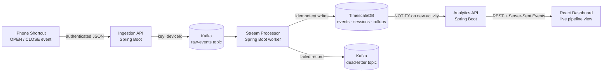

# Project Brain

Where the project actually stands, and why it's built the way it is. For
what each piece does day to day, see [README.md](README.md).

## What this is

A personal data-engineering project: track real phone usage — which app,
when it opened and closed, on which device — and turn that into live,
queryable analytics. It started scoped to Instagram only; it now tracks
whichever apps a Shortcut reports (40+ so far), with no app-specific code.

The point isn't the usage dashboard itself. It's building the same shape of
platform a real product would run: an event stream, durable and replayable;
a processing layer that's the only writer to the database; a staging
environment that behaves like production instead of a toy; and a deploy
pipeline that *enforces* "test before you ship" instead of just documenting
it.

## Architecture

Ingestion, Kafka, and the stream processor exist only to get an event into
TimescaleDB correctly and exactly once. The analytics API and dashboard
exist only to read it back. Nothing in between owns both jobs.

## Staging and production

One codebase, one set of Kubernetes manifests, deployed twice with
different configuration — not two forks that can drift apart.

| | Staging | Production |
| --- | --- | --- |
| Deploys | Automatically, on every merge to `main` | Manually, and only if staging already matches `main` |
| Database | Its own TimescaleDB | The real one |
| Kafka | Its own topics + consumer group; also consumes production's real raw-event topic, read-only | Its own topics + consumer group |
| Reachable at | Tailnet-only | Public (Tailscale Funnel), rate-limited |

Kafka has no ACLs on this cluster, so nothing stops a misconfigured staging
consumer from writing into production's topics except the config actually
being right. CI renders both environments' manifests and fails the build if
staging's config would ever touch a production topic, consumer group, or
node port — so isolation is checked, not assumed.

Production promotion works the same way: the workflow that ships to
production refuses to run unless staging is already running the exact
commit being promoted. "Staging is tested before production ships" is
enforced by the pipeline, not a rule someone has to remember to follow.

## Decisions worth remembering

**Kafka has no ACLs, so staging is isolated by configuration, not by a
second cluster.** A full duplicate Kafka/TimescaleDB per environment would
be heavier than a homelab needs. Separate topics, a separate consumer
group, and a CI check that verifies both are the actual mechanism.

**Staging reads production's real event stream.** Its own `ingestion-api`
exists for sending test events, but the stream processor also consumes
production's live topic under its own consumer group — so a change to
sessionization or rollups gets tested against real usage before release,
without staging ever writing to production's data.

**Identifiers are stored exactly as sent, not slugified.** Names used to be
lowercased and dashed (`Google Maps` → `google-maps`) for a clean key. That
made the dashboard illegible. Now the only normalization is trimming
whitespace — what the app is called is what gets displayed.

**Live activity uses Postgres `LISTEN/NOTIFY` + Server-Sent Events, not a
new message bus.** The stream processor already writes to Postgres inside a
transaction; a trigger firing `NOTIFY` on that same write is the cheapest
way to get "this really just happened" to the browser, with nothing new to
run or operate.

**Production promotion is manual, but guarded.** Auto-deploying every merge
straight to a public dashboard felt wrong. A one-click manual promotion
that's still enforced against "staging must match first" gets the safety
without needing a human to remember to check.

## What's done

- Ingestion, Kafka (with a dead-letter topic), stream processor, and
  TimescaleDB — deployed identically to staging and production.
- Sessionization (opens paired with closes, duplicates and unmatched
  closes recorded as anomalies) and minute/hour/day rollups.
- A read-only analytics API, including one combined endpoint per dashboard
  view and a live Server-Sent Events stream.
- A React + TypeScript dashboard: usage charts, sessions, a "top used
  today" ranking, app icons looked up automatically from the App Store,
  a mobile-responsive layout, and an illustrated, animated diagram of the
  pipeline itself.
- GitOps deployment via Argo CD; GitHub Actions running tests, image
  builds, and manifest validation on every change; a guarded, one-command
  production promotion.
- Public exposure over a Tailscale Funnel, rate-limited per visitor.

## What's next

- No automated runtime smoke tests yet — a passing CI run confirms tests
  and a successful deploy, not end-to-end health after that.
- Historical rows recorded before exact-name matching still use their old
  lowercase slug names; they were never backfilled.
- Further out, and not started: collectors beyond the iPhone Shortcut
  (e.g. a native app, a desktop collector), and using the now-real
  historical data for forecasting or anomaly detection.

## Mental model

Collectors create events. Kafka holds the stream. A processor turns it into
facts. The database stores those facts. APIs serve them. A dashboard shows
them — live, not just on refresh.

The dashboard is the visible part. The reason to keep building it is
everything underneath it: a real streaming platform, the isolation and
promotion guarantees around it, and how each of those choices got made.
